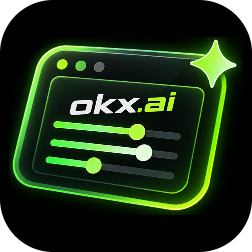
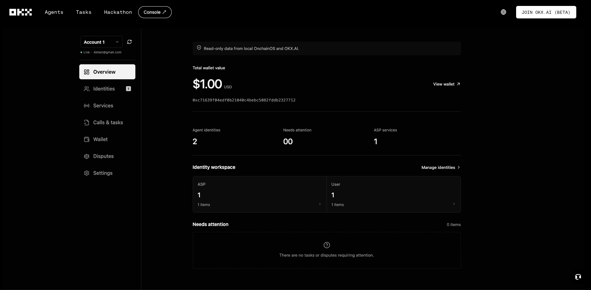

<p align="center">
  
</p>

<h1 align="center">Onchain OS Console</h1>

<p align="center">把本机 OnchainOS CLI 数据带到 OKX.AI 的只读个人控制台。<br />A local, read-only personal console for OnchainOS data inside OKX.AI.</p>

## Preview / 预览



> 非 OKX 官方产品。此项目不会读取钱包私钥，也不会发起签名、付款或链上交易。
>
> This is not an official OKX product. It does not read wallet private keys or initiate signatures, payments, or onchain transactions.

## 中文

### 为什么做这个项目

OKX.AI 上的 Agent、服务与任务逐渐增多，但与个人相关的数据主要分散在 OnchainOS CLI 的不同命令和本机记录中。用户需要反复切换终端，才能确认自己有哪些身份、钱包地址、服务、调用、订阅和交易记录；当结果为空时，也很难立即判断是“确实没有数据”、登录失效，还是接口查询失败。

Onchain OS Console 希望补上这个个人控制台：不复制一套账户系统，也不托管用户数据，而是在用户已经使用的 OKX.AI 页面中，将本机 CLI 能确认的数据整理成带有来源状态的只读视图。它尤其解决以下问题：

- 将分散的 CLI 查询集中到一个界面，减少重复命令和上下文切换。
- 展示钱包地址、调用记录和付款/结算状态等容易遗漏的信息。
- 明确区分空数据、查询错误与暂不支持的数据，避免用占位内容制造“看起来完整”的假象。
- 沿用 OKX.AI 原生 header、footer 和页面滚动体验，不再依赖狭窄的插件侧边栏。

### 如何解决

```text
OKX.AI 专用路由
  → Chrome 扩展后台
  → Native Messaging
  → 本机 Node Companion
  → 只读 OnchainOS CLI 命令
```

扩展在 `/_onchain-os-console` 只替换原本的 404 内容区，并把隔离的控制台 iframe 嵌入其中。界面请求经扩展后台发送给 Native Messaging 宿主；Companion 由 Chrome 按需启动，并在 Native Messaging 端口存续期间复用。它按固定白名单调用 OnchainOS CLI，再将结果规范化后返回。

项目只接入已经通过 CLI 实际响应确认的结构化字段。登录有效时，每个已接入来源都会同时返回可用性状态；登录失效时则统一提示重新登录。因此界面可以说明“有数据”“当前为空”“查询失败”或“CLI 暂无结构化数据”，而不是猜测字段和业务结果。本机数据模式只提供查看能力，所有模拟操作只存在于隔离的开发预览中。

### 功能

- 在 OKX.AI 顶栏增加「控制台」入口，并在 `/_onchain-os-console` 替换 404 内容区；原生 header 与 footer 保持不变。
- 通过 Chrome Native Messaging 连接由 Chrome 按需启动的本机 Node Companion，再调用 OnchainOS CLI 获取数据快照；扩展页面本身不运行 Node。
- 汇总本机账户、Agent 身份与审核、ASP 服务、调用与任务、订阅、钱包地址、资产、流水、争议与评价。
- 设置页明确区分“有数据”“当前为空”“查询失败”和“暂无结构化数据”，不把空结果伪装成故障或业务状态。
- 自适应深色界面，以及支持筛选与详情查看的控制台交互。

### 环境要求

- Node.js 22.14+
- Chrome 116+ 桌面版
- 已安装并可运行 OnchainOS CLI

### 安装

```sh
git clone https://github.com/BiscuitCoder/okxai_console.git
cd okxai_console
npm ci
npm test
npm run build
npm run companion:install
```

确认 `onchainos wallet status` 显示已登录；若登录过期，请运行 `onchainos wallet login`。随后打开 `chrome://extensions`，开启开发者模式，选择“加载已解压的扩展程序”，加载项目中的 `dist` 目录。

访问或刷新 [OKX.AI](https://www.okx.ai/zh-hans)，从顶栏进入「控制台」。未安装扩展时，`https://www.okx.ai/_onchain-os-console` 仍是正常的 404 页面。

开发界面时可运行：

```sh
npm run dev
```

浏览器预览使用隔离的模拟数据，不代表 Native Messaging 已连接。需要验证真实数据时，请加载构建后的扩展。

### 安全模型

安全不是一句“只读”声明，而是由权限、调用路径和数据处理共同限制：

| 用户可能担心什么       | 项目如何限制风险                                                                                                                                         |
| ---------------------- | -------------------------------------------------------------------------------------------------------------------------------------------------------- |
| 会读取私钥或助记词吗？ | 不读取 OnchainOS 凭证文件，不请求私钥、助记词或签名材料，也没有签名和交易入口。                                                                          |
| 会读取 OKX.AI 网页吗？ | 内容脚本只挂载导航和替换专用路由 DOM，并仅读取网页可访问的 `locale` Cookie 以跟随界面语言；不申请 `cookies` 或 `webRequest` 权限，也不解析网页账户数据。 |
| 能执行任意本机命令吗？ | Companion 协议只接受 `snapshot`；网页和扩展请求不能传入命令或参数。固定命令通过 `execFile` 参数数组执行，不经过 shell。                                  |
| 数据会发到哪里？       | 快照只在本机 Companion 与扩展 iframe 间传递；项目没有自建服务器、遥测或云同步。CLI 查询仍会按其自身配置访问 OKX 服务。                                   |
| OKX.AI 能读取快照吗？  | 控制台 iframe 是 `chrome-extension://` 独立来源，OKX.AI 页面脚本不能读取其中的数据；后台也只接受专用路由内的扩展 iframe。                                |
| 返回内容包含令牌吗？   | 数据进入扩展前会按已知敏感字段键名递归移除 Token、API Key、Session、TEE、私钥、助记词、签名和原始交易等内容。新增上游字段仍需持续审查。                  |

扩展仅申请 `storage`、`nativeMessaging` 和两个 OKX.AI HTTPS 域名权限。账户选择只保存在 `chrome.storage.local`，不进行云同步。每条 CLI 命令限制为 20 秒和 2 MB 输出；本机数据模式没有平台写入、领取、付款或登录操作。`companion:install` 只会在 Chrome 的 NativeMessagingHosts 目录注册宿主清单并创建固定启动脚本，不会安装系统守护进程。代码完全公开，安装前可以直接审查 [manifest](./public/manifest.json)、[扩展后台](./src/background.ts) 和 [Companion](./companion.mjs)。

对于支持且显式指定分页的查询，当前只读取第一页、最多 50 条；其他查询遵循 CLI 的默认返回范围。CLI 只有可读文本、没有稳定结构化输出的数据不会被猜测解析。

更多连接机制与命令范围见 [COMPANION.md](./COMPANION.md)。

---

## English

### Why this project exists

As the number of Agents, services, and tasks on OKX.AI grows, personal data remains spread across separate OnchainOS CLI commands and local records. Users must repeatedly switch to a terminal to understand their identities, wallet addresses, services, invocations, subscriptions, and transactions. An empty response also leaves an important ambiguity: there may be no data, the login may have expired, or the query may have failed.

Onchain OS Console fills that personal-console gap. It does not create another account system or host user data. Instead, it organizes data that the local CLI can verify into a read-only view with explicit source status inside the OKX.AI experience. In practical terms, it:

- Consolidates fragmented CLI queries and reduces repeated commands and context switching.
- Surfaces wallet addresses, invocation records, and payment or settlement status that are otherwise easy to miss.
- Separates empty data, failed queries, and unsupported data instead of filling the UI with invented placeholders.
- Reuses the native OKX.AI header, footer, and page scrolling rather than relying on a narrow extension sidebar.

### How it works

```text
Dedicated OKX.AI route
  → Chrome extension background
  → Native Messaging
  → Local Node companion
  → Read-only OnchainOS CLI commands
```

At `/_onchain-os-console`, the extension replaces only the original 404 content and embeds an isolated console iframe. UI requests go through the extension background to a Native Messaging host. Chrome starts the local companion on demand and reuses it while the Native Messaging port remains open. The companion invokes a fixed allowlist of OnchainOS CLI commands, normalizes their results, and returns the snapshot.

Only structured fields verified against real CLI responses are integrated. When the login is valid, every integrated source reports its availability; an expired login produces a single login warning. This lets the UI distinguish available, empty, failed, and currently unstructured data without guessing fields or business outcomes. Local-data mode is display-only; simulated actions exist only in the isolated development preview.

### Features

- Adds a Console entry to the OKX.AI header and replaces only the 404 content at `/_onchain-os-console`, preserving the native header and footer.
- Uses Chrome Native Messaging to connect to a local Node companion started on demand by Chrome. The companion calls the OnchainOS CLI for a data snapshot; Node does not run inside the extension page.
- Brings together local accounts, Agent identities and approval status, ASP services, invocations and tasks, subscriptions, wallet addresses, balances, transactions, disputes, and feedback.
- Clearly distinguishes available, empty, failed, and unstructured data instead of inventing values or treating an empty result as an error.
- Includes a responsive dark UI with filtering and record-detail interactions.

### Requirements

- Node.js 22.14+
- Chrome 116+ for desktop
- A working OnchainOS CLI installation

### Installation

```sh
git clone https://github.com/BiscuitCoder/okxai_console.git
cd okxai_console
npm ci
npm test
npm run build
npm run companion:install
```

Verify that `onchainos wallet status` reports an active login. If it has expired, run `onchainos wallet login`. Open `chrome://extensions`, enable Developer mode, choose **Load unpacked**, and select this project's `dist` directory.

Open or refresh [OKX.AI](https://www.okx.ai/), then use the Console item in the header. Without the extension, `https://www.okx.ai/_onchain-os-console` remains a normal 404 page.

For UI development:

```sh
npm run dev
```

The browser preview uses isolated mock data and does not validate Native Messaging. Load the built extension to verify live local data.

### Security model

Security is enforced through permissions, the request path, and data handling—not merely by describing the product as “read-only.”

| Concern                          | Protection                                                                                                                                                                                                                                            |
| -------------------------------- | ----------------------------------------------------------------------------------------------------------------------------------------------------------------------------------------------------------------------------------------------------- |
| Does it read private keys?       | It does not read OnchainOS credential files or request private keys, seed phrases, or signing material. There is no signing or transaction entry.                                                                                                     |
| Does it inspect the OKX.AI page? | The content script only mounts navigation and replaces the dedicated route DOM. It reads only the page-accessible `locale` cookie to follow the UI language; it has no `cookies` or `webRequest` permission and parses no account data from the page. |
| Can it run arbitrary commands?   | The companion accepts only `snapshot`; pages and extension requests cannot supply commands or arguments. Fixed commands use an `execFile` argument array without a shell.                                                                             |
| Where does the data go?          | Snapshots pass only between the local companion and extension iframe. The project has no backend, telemetry, or cloud sync. CLI queries still access OKX services according to their own configuration.                                               |
| Can OKX.AI read the snapshot?    | The console iframe has an isolated `chrome-extension://` origin, so OKX.AI page scripts cannot read its data. The background also accepts only the extension iframe on the dedicated route.                                                           |
| Can tokens reach the UI?         | Known sensitive field names are recursively removed, including tokens, API keys, sessions, TEE data, private keys, seed phrases, signatures, and raw transactions. New upstream fields still require review.                                          |

The extension requests only `storage`, `nativeMessaging`, and the two OKX.AI HTTPS host permissions. Account selection remains in `chrome.storage.local` and is not synced. Each CLI command has a 20-second timeout and a 2 MB output limit. Local-data mode has no platform write, claim, payment, or login operations. `companion:install` only registers a host manifest in Chrome's NativeMessagingHosts directory and creates a fixed launcher; it does not install a system daemon. The code is open for inspection: review the [manifest](./public/manifest.json), [extension background](./src/background.ts), and [companion](./companion.mjs) before installing.

For queries that support and explicitly specify pagination, the console currently reads only the first page, up to 50 records; other queries follow the CLI's default response range. Data without stable structured CLI output is not guessed or scraped.

See [COMPANION.md](./COMPANION.md) for the connection model and command scope.
